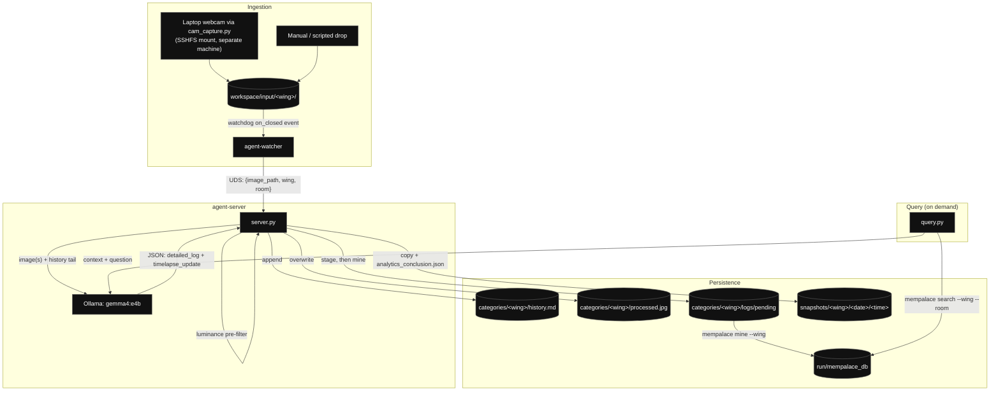

# System Architecture

This document outlines the multi-container microservice orchestration for the
Autonomous Context Agent Pipeline.

## Core Architecture Diagram

The system is an event-driven loop across isolated container boundaries, using a
Unix Domain Socket (UDS) for the watcher→server handoff and bind-mounted volumes
for all durable state:



---

## Container Layout & Service Responsibilities

### 1. `agent-watcher`
- **Runtime:** Python 3.11-slim
- **Dependencies:** `watchdog`, `pillow`
- **Purpose:** Mounts `workspace/input/` via a Docker volume and monitors for file
  creation events (`.jpg`, `.png`). On each finalized write, it resolves the wing
  (and room, if the file sits two folders deep) from the relative path and
  dispatches `{image_path, wing, room}` to `agent-server` over the UDS socket.

### 2. `agent-server`
- **Runtime:** Python 3.11-slim
- **Dependencies:** `ollama`, `mempalace`, `pillow`
- **Purpose:** Listens on the UDS socket. Runs the L1 luminance pre-filter, then
  calls the local VLM (Ollama, `gemma4:e4b`) with the current frame plus whatever
  category context exists — `baseline.jpg`, the last `processed.jpg`, and the tail
  of `history.md`. Persists results to `categories/`, `snapshots/`, and stages +
  mines logs into MemPalace.

### 3. MemPalace (CLI, not a separate container)
- **Installed into:** `agent-server`'s image (`pip install mempalace`)
- **Config:** `run/mempalace_db/` (bind-mounted; `mempalace_config.json` points
  `palace_path` here)
- **Purpose:** Persistent vector memory layer, isolated by wing/room. Invoked as a
  subprocess from `server.py` (`mempalace mine`) and `query.py` (`mempalace search`)
  — there is no standalone MemPalace container/image in this stack.

### 4. `ollama` (host or sidecar, CUDA-accelerated)
- **Purpose:** Serves the `gemma4:e4b` multimodal model that `agent-server` calls
  over HTTP (`OLLAMA_HOST`).

---

## Per-Category Storage Layout

```text
categories/<wing>/
├── baseline.jpg        # optional — fixed reference photo for this wing
├── processed.jpg        # auto-managed — last frame processed (also the
│                         #   "previous frame" reference for the next timelapse diff)
├── history.md            # auto-managed — running timelapse journal
└── logs/
    ├── pending/<room>/    # staged log files awaiting the next `mempalace mine`
    └── mined/<room>/       # archived after a successful mine (never re-mined)
```

---

## Daily Workflow Commands

### Starting the ecosystem
```bash
docker compose up -d --build
```

### Tailing logs
```bash
docker compose logs -f agent-server agent-watcher
```

### Checking what's actually stored
```bash
docker compose exec agent-server mempalace status
```
