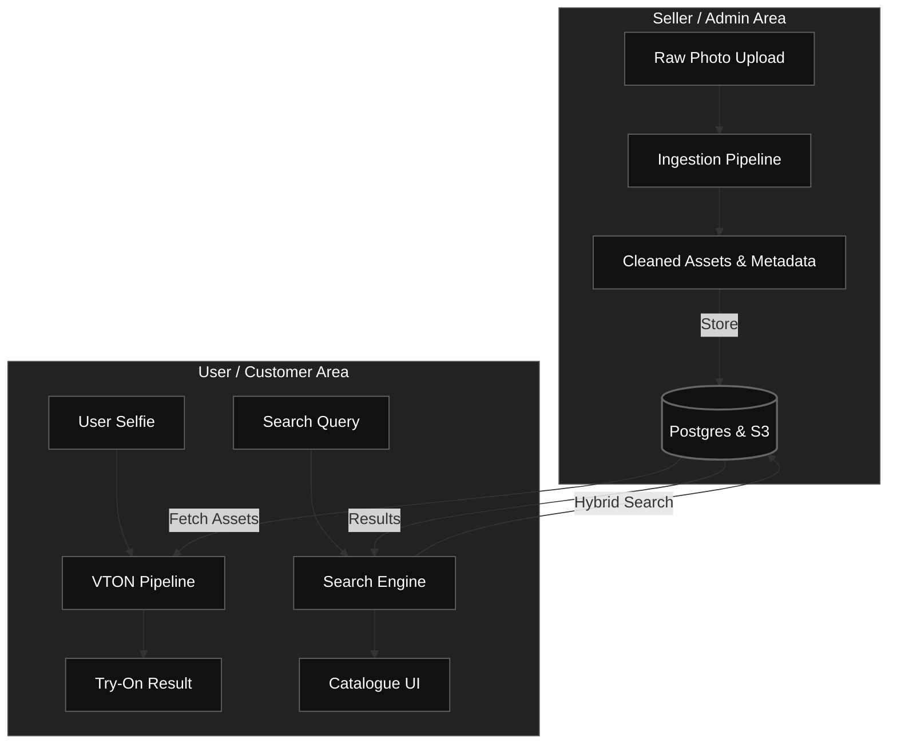

# System Architecture 

This document outlines the multi-container microservice orchestration for the Autonomous Context Agent Pipeline, replacing the legacy local virtual environment (`.venv`) setup.

##  Core Architecture Diagram

The system operates as an event-driven loop across isolated container boundaries using Unix Domain Sockets (UDS) and local network bridges:


---

##  Container Layout & Service Responsibilities

### 1. `agent-watcher`
* **Runtime:** Python 3.11-slim
* **Dependencies:** `watchdog`, `pillow`
* **Purpose:** Mounts the host machine's `workspace/input/` directory via a Docker volume. It continuously monitors for file creation events (e.g., asset drops like `.jpg`, `.png`). Upon discovery, it passes the file metadata down the line.

### 2. `agent-server`
* **Runtime:** Python 3.11-slim
* **Dependencies:** `ollama`, `mempalace`
* **Purpose:** Intercepts incoming file pathways over an internal IPC channel. It calculates local image metrics (like L1 luminance intensity filtering) and orchestrates structural prompts out to the local VLM engine.

### 3. `mempalace_db`
* **Image:** Independent Microservice
* **Configuration:** `run/mempalace_db/mempalace.yaml`
* **Purpose:** Acts as the persistent vector memory layer. It isolates storage boundaries, entity spaces, and contextual tracks without bloating the core application scripts.

---

## ⚙️ Daily Workflow Commands

### Starting the Ecosystem
To boot up the entire background cluster (watcher, processing server, network hooks, and storage nodes):
```bash
docker compose up -d
